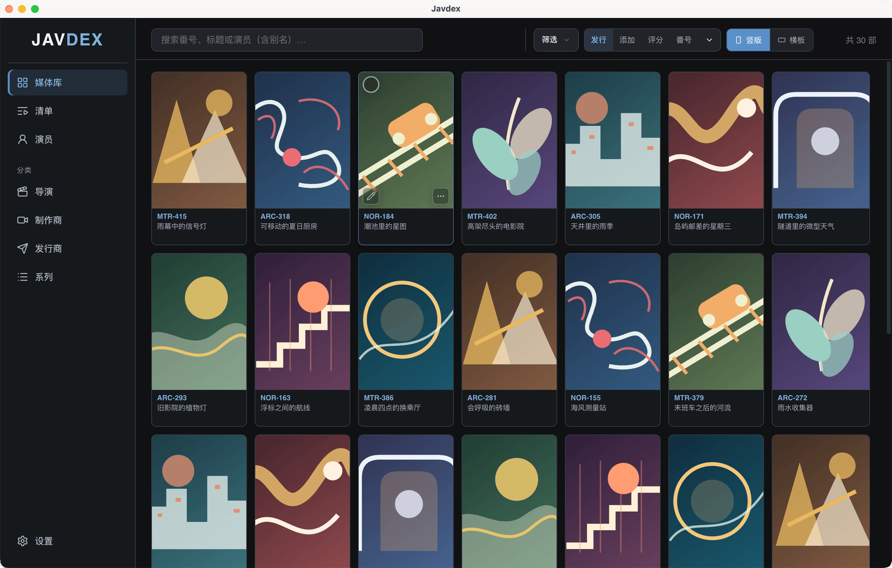

<p align="center">
  <a href="https://javdexlabs.github.io/Javdex/">
    
  </a>
</p>

<h1 align="center">Javdex</h1>

<p align="center">
  <strong>把本地媒体整理成清晰、可搜索、可维护的资料库。</strong>
</p>

<p align="center">
  本地优先 · 插件驱动 · Windows / macOS / Linux
</p>

<p align="center">
  <a href="https://github.com/JavdexLabs/Javdex/releases/latest"></a>
  <a href="LICENSE"></a>
  <a href="https://javdexlabs.github.io/Javdex/"></a>
</p>

<h3 align="center">
  <a href="https://javdexlabs.github.io/Javdex/">访问官网</a>
  &nbsp;·&nbsp;
  <a href="https://github.com/JavdexLabs/Javdex/releases/latest">下载最新版</a>
  &nbsp;·&nbsp;
  <a href="CHANGELOG.md">更新日志</a>
</h3>

<br>

<p align="center">
  <a href="https://javdexlabs.github.io/Javdex/">
    
  </a>
</p>

<p align="center">
  <sub>媒体库、搜索、筛选与多种浏览维度集中在一个安静的桌面工作区。</sub>
</p>

## 获取 Javdex

推荐前往 **[Javdex 官网](https://javdexlabs.github.io/Javdex/)**。官网会说明不同平台和安装包格式的区别，并提供最新正式版下载入口。

也可以直接访问 **[GitHub Releases](https://github.com/JavdexLabs/Javdex/releases/latest)**，查看更新说明和全部安装文件。

| 平台 | 提供格式 |
|---|---|
| Windows 10 / 11（x64） | EXE 安装版、ZIP 免安装版 |
| macOS 11+ | Apple Silicon DMG、Intel DMG |
| Linux（x86_64） | AppImage、DEB |

> [!IMPORTANT]
> 当前安装包尚未进行商业代码签名，系统可能提示“未知发布者”。请只从项目官网或 GitHub Releases 下载。当前版本不提供自动升级，更新时需要重新下载安装包。

## 为什么选择 Javdex

- **本地优先**：SQLite 数据库、设置与图片资产默认保存在设备中。
- **快速建库**：递归扫描目录，识别常见视频格式并从复杂文件名解析编号。
- **插件化元数据**：按字段组合影片与人物插件，获取结构化资料和图片资产。
- **高效维护**：支持搜索、筛选、分类、清单、批量任务和多文件关联。
- **人物资料**：维护头像、写真、别名与关联作品，并可在本地完成头像构图。
- **开放扩展**：内置插件开发助手，并提供可选 MCP 服务接入外部开发工具。

## 本地意味着什么

Javdex 围绕你已有的本地文件建立索引。数据库、下载的图片和应用设置由你掌控；播放时调用系统默认播放器，本地人脸检测也不需要上传图片。

Javdex 不提供、不托管、不分发任何媒体内容，也不内置在线播放服务。

默认数据位置：

```text
userData/
  data/library.db
  media_assets/
    covers/
    avatars/
    actress_gallery/
    samples/
    playlist_covers/
```

图片资产可选择加密存储，并通过应用的 `media://` 协议读取。

## 核心能力

### 媒体库

- 扫描本地目录并识别常见视频格式
- 解析编号、关联多个本地文件、迁移变化后的路径
- 按人物、标签、制作方、发行方、系列与导演浏览
- 支持搜索、组合筛选、排序、清单与批量选择

### 元数据与图片

- 插件化获取标题、简介、日期、评分、标签与关联资料
- 本地保存封面、海报、样张、头像与写真
- 支持单项刮削、批量刮削、重匹配和字段级更新策略
- 批量任务可暂停、恢复或取消

### 插件开发

- 视频与人物两类插件，可按字段组合数据来源
- Worker 沙箱隔离插件代码，仅暴露受控 `ctx` API
- 内置 ReAct 风格开发助手，支持页面探测、代码生成、dry-run 与语义验证
- 可选 MCP 服务连接 IDE 或其它开发工具

插件格式和运行时 API 见 [刮削插件规范](docs/SCRAPER_PLUGIN_FORMAT.md)，开发助手工作流见 [插件开发 Agent 文档](docs/PLUGIN_DEV_AGENT.md)。

## 开发

### 环境要求

- Node.js 22（推荐使用与 CI 相同的版本）
- npm
- Windows、macOS 或 Linux

`better-sqlite3` 是原生模块，安装依赖后会通过 `electron-rebuild` 针对 Electron 重新编译。

### 本地启动

```bash
git clone https://github.com/JavdexLabs/Javdex.git
cd Javdex
npm install
npm run dev
```

### 检查与构建

```bash
npm test             # 类型检查与单元测试
npm run build        # 生产构建
npm start            # 预览生产构建
```

### 打包

```bash
npm run packaging:list       # 查看打包目标
npm run packaging:configure  # 交互配置目标
npm run dist                 # 构建当前启用目标
npm run dist:win             # Windows
npm run dist:mac             # macOS
npm run dist:linux           # Linux
```

打包目标配置位于 [`build/packaging.targets.json`](build/packaging.targets.json)。

### 官网

```bash
npm run pages:build
npm run pages:preview
```

Pages 构建会读取最新正式版 GitHub Release，并生成各平台下载链接。合并官网改动到 `main` 或成功发布新版后，GitHub Actions 会自动重新部署官网。

## 技术概览

Javdex 基于 Electron、React、TypeScript、Vite 和 `better-sqlite3` 构建。

- `src/main`：数据库、扫描、刮削、资产、LLM 与应用生命周期
- `src/preload`：通过 `contextBridge` 暴露安全 IPC API
- `src/renderer`：React 页面、组件与查询状态
- `src/shared`：跨进程类型和 IPC 通道
- `src/mcp`：插件开发 MCP 服务

渲染进程不直接访问 Node.js、数据库或文件系统，相关操作统一由主进程处理。

## 文档

| 文档 | 内容 |
|---|---|
| [版本与发布](docs/VERSIONING_AND_RELEASE.md) | 版本号、标签与 Release 流程 |
| [刮削插件规范](docs/SCRAPER_PLUGIN_FORMAT.md) | 插件包格式与沙箱 API |
| [插件开发 Agent](docs/PLUGIN_DEV_AGENT.md) | 开发助手与 MCP 工作流 |
| [UI 设计规范](docs/UI_DESIGN_GUIDELINES.md) | 视觉原则与语义 token |
| [路由设计](docs/ROUTING_DESIGN.md) | 页面路由、查询状态与返回栈 |
| [更新日志](CHANGELOG.md) | 版本变更记录 |

## 反馈

- 发现问题：[提交 Issue](https://github.com/JavdexLabs/Javdex/issues/new)
- 查看计划：[现有 Issues](https://github.com/JavdexLabs/Javdex/issues)
- 获取版本：[GitHub Releases](https://github.com/JavdexLabs/Javdex/releases/latest)

## 使用边界

- Javdex 仅用于管理用户本地已有的媒体文件。
- 刮削插件仅用于获取公开网页上的元数据信息。
- 请遵守所在地法律法规及目标网站的使用条款。
- 项目名称、插件名称和站点名称仅用于功能说明，不代表与第三方存在从属或合作关系。

## License

Javdex 基于 [MIT License](LICENSE) 开源。

Copyright (c) 2026 Javdex
