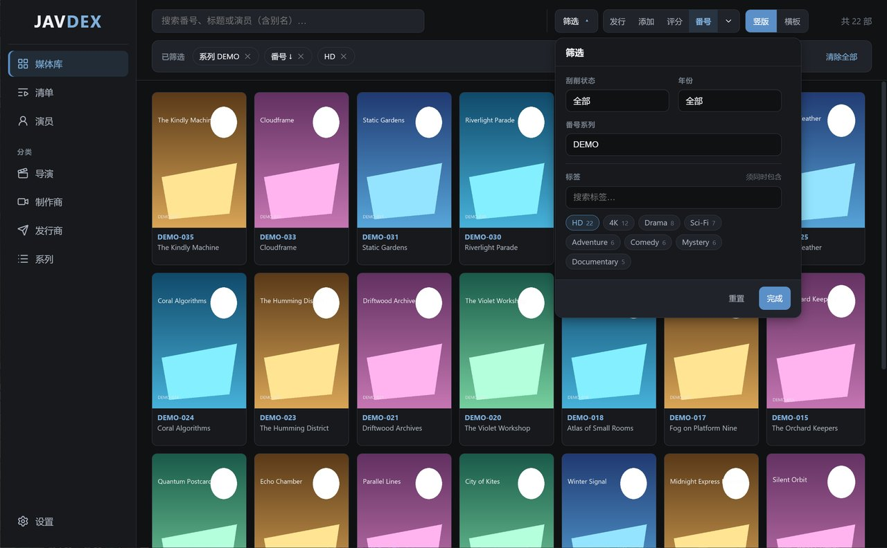
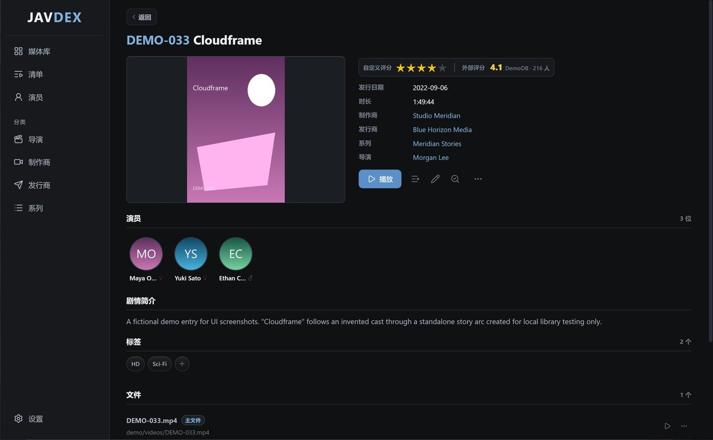
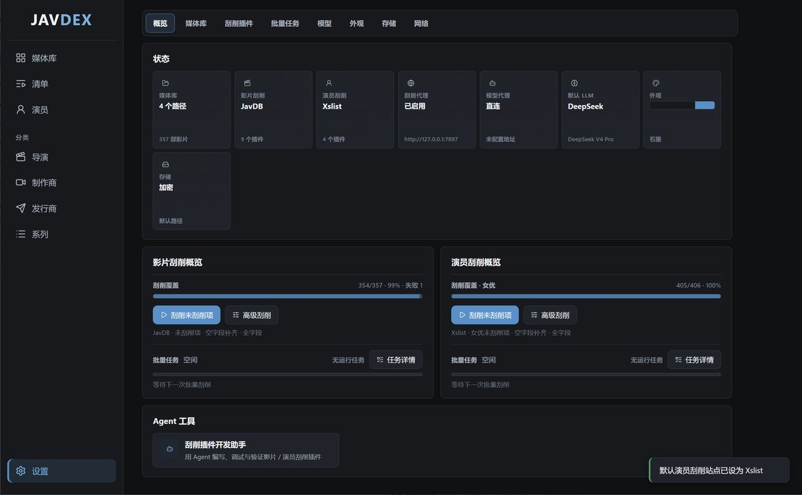

<p align="center">
  
</p>

<p align="center">
  <strong>本地优先、插件驱动、可扩展的本地媒体库管理器。</strong>
</p>

<p align="center">
  <a href="#技术栈"></a>
  <a href="#技术栈"></a>
  <a href="#技术栈"></a>
  <a href="#数据存储"></a>
  <a href="LICENSE"></a>
</p>

---

## 项目简介

**Javdex** 是一款基于 **Electron + React + TypeScript** 构建的本地桌面应用，用于管理本地 JAV 媒体库。

它可以扫描本地视频文件、自动解析番号、建立 SQLite 媒体数据库，并通过插件化刮削系统获取影片元数据、演员资料、封面、样张、写真、标签、评分等信息。

Javdex 专注于 **本地媒体整理与元数据管理**。软件本身不内置在线播放器，也不提供任何媒体内容；播放时会调用系统默认播放器打开本地文件。

版本号、Git 标签与 GitHub Release 的维护方式见 [`docs/VERSIONING_AND_RELEASE.md`](docs/VERSIONING_AND_RELEASE.md)。

---

## 功能特性

### 本地媒体库管理

- 递归扫描本地视频目录
- 自动识别常见视频格式
- 基于文件名解析番号
- 支持同一番号关联多个本地文件
- 支持文件路径变化后的元数据迁移
- 支持无效文件、缺失文件清理
- 支持手动修正番号与手动导入

### 智能番号解析

Javdex 内置多层番号识别规则，支持多种常见命名格式：

- 标准格式：`ABC-123`
- 长前缀格式：`ADVVSR-486`
- FC2：`FC2-1234567`
- HEYZO：`HEYZO-1234`
- DMM Content ID：`h_1472xxxx003`
- 日期类无码番号：`020326_001-1PON`
- 带站点名、清晰度、字幕、编码信息等噪声的文件名

### 插件化元数据刮削

Javdex 使用插件系统获取网络元数据，支持：

- 影片标题、简介、封面、发行日期
- 片商、发行、系列、导演
- 演员列表与演员头像
- 标签、评分、样张
- 演员生日、身高、三围、杯型、别名、写真等资料
- 内置插件与用户自定义插件
- 视频插件与演员插件
- 组合刮削器：不同字段可由不同插件提供

### 批量刮削

- 支持单个影片刮削
- 支持批量刮削
- 支持批量重匹配
- 支持按字段选择更新内容
- 支持空字段补齐、有值覆盖、覆盖更新
- 支持刮削队列暂停、恢复、取消
- 支持随机间隔，降低请求频率

### 演员资料管理

- 演员列表与详情页
- 演员头像、写真、资料字段管理
- 演员别名管理
- 演员归并
- 使用本地人脸检测与关键点模型统一头像构图，图片无需上传
- 按演员浏览关联影片

### 清单与分类

- 播放清单
- 标签管理
- 片商 / 发行 / 系列 / 导演等维度浏览
- 多条件筛选
- 搜索、排序、批量选择

### 图片资产本地化

刮削到的图片会下载到本地资产目录，包括：

- 影片封面
- 海报
- 样张
- 演员头像
- 演员写真
- 播放清单封面

渲染进程通过自定义 `media://` 协议安全读取本地资产。

### 资产加密

Javdex 支持图片资产加密存储。启用后，下载的图片会以加密形式保存到本地，并在应用内通过安全协议读取。

### LLM 集成

Javdex 支持配置多种 LLM 提供商，用于：

- 元数据翻译
- 插件开发 Agent
- 插件代码生成与调试

内置支持多种 OpenAI Chat Completions 兼容接口及 Anthropic Messages 兼容接口。

### 插件开发 Agent

Javdex 内置 ReAct 风格插件开发助手，可辅助开发刮削插件：

- 自动探测网页结构
- 自动编写插件代码
- dry-run 试运行
- 语义验证
- 安装插件
- 支持 Cloudflare / challenge 场景下暂停等待用户验证

同时提供可选 MCP 服务，便于外部 IDE 或工具链接入插件开发流程。

---

## 截图

<p align="center">
  
</p>

<p align="center">
  
</p>

<p align="center">
  
</p>

---

## 技术栈

- **Electron**：桌面应用运行时
- **React 18**：前端界面
- **TypeScript**：主进程、预加载脚本、渲染进程统一类型开发
- **Vite / electron-vite**：构建与开发环境
- **better-sqlite3**：本地 SQLite 数据库
- **React Router**：前端路由
- **TanStack Query**：前端数据请求与缓存
- **Cheerio**：HTML 解析
- **Undici / Axios**：网络请求
- **electron-builder**：安装包与跨平台构建

---

## 架构设计

Javdex 严格遵循 Electron 进程分离原则。

```text
src/
  main/
    index.ts                 应用生命周期、窗口创建、media:// 协议注册
    db/                      SQLite 初始化、Schema、Repository、迁移
    settings/                设置持久化
    scanner/                 文件扫描、视频时长读取、番号解析
    scrapers/                刮削插件运行时、浏览器会话、challenge 处理
    bundled-plugins/         内置刮削插件
    services/                资产、LLM、批量刮削、插件开发、播放器等服务
    ipc/                     IPC 处理器注册中心

  preload/
    index.ts                 contextBridge 安全桥

  renderer/
    src/                     React 前端页面、组件、hooks、query

  shared/
    types.ts                 跨进程共享类型
    ipc-channels.ts          IPC 通道定义
    llmProviders.ts          LLM 提供商定义

  mcp/
    javdex-plugin-dev-server.ts
```

### 主进程

主进程负责所有 Node.js 能力，包括：

- SQLite 数据库读写
- 文件系统扫描
- 本地资产读写
- 网络请求与代理
- 刮削插件运行
- 外部播放器调用
- 自定义 `media://` 协议

### 预加载脚本

预加载脚本通过 `contextBridge` 暴露安全 API 给前端。

渲染进程不会直接访问 Node.js、数据库或文件系统，所有操作均通过 Promise 化 IPC 完成。

### 渲染进程

渲染进程是纯 React 应用，负责：

- 媒体库页面
- 影片详情页
- 演员页
- 清单页
- 分类页
- 设置页
- 插件开发工作台

---

## 数据存储

### 数据库

Javdex 使用 SQLite 作为本地数据库。

默认数据库路径：

```text
userData/data/library.db
```

Windows 下通常位于：

```text
%APPDATA%/Javdex/data/library.db
```

数据库启用：

- WAL 模式
- 外键约束
- Schema 版本管理

主要数据表包括：

- `videos`
- `video_files`
- `actresses`
- `actress_names`
- `video_actress`
- `tags`
- `video_tag`
- `playlists`
- `playlist_video`
- `facet_entries`
- `video_assets`
- `video_external_ids`
- `video_external_stats`
- `actress_gallery_assets`

### 媒体资产

默认资产目录：

```text
userData/media_assets/
```

包含：

```text
media_assets/
  covers/
  avatars/
  actress_gallery/
  samples/
  playlist_covers/
```

应用内不会直接暴露真实文件路径，而是通过：

```text
media://...
```

读取本地图片资源。

---

## 安装与开发

### 环境要求

- Node.js 18+
- npm
- Windows / macOS / Linux

> `better-sqlite3` 是原生模块，安装依赖后会通过 `electron-rebuild` 针对 Electron 重新编译。

### 安装依赖

```bash
npm install
```

### 启动开发环境

```bash
npm run dev
```

### 生产构建

```bash
npm run build
```

### 预览生产构建

```bash
npm start
```

### 类型检查与测试

```bash
npm test
```

---

## 打包

Javdex 使用 `electron-builder` 打包。

### 查看可用打包目标

```bash
npm run packaging:list
```

### 交互配置打包目标

```bash
npm run packaging:configure
```

### 打包当前启用目标

```bash
npm run dist
```

### 按平台打包

```bash
npm run dist:win
npm run dist:mac
npm run dist:linux
```

当前打包目标配置位于：

```text
build/packaging.targets.json
```

支持的目标包括：

- Windows NSIS 安装包
- Windows ZIP 解压版
- Windows Portable 便携版
- macOS DMG
- macOS ZIP
- Linux AppImage
- Linux deb
- Linux rpm

---

## 刮削插件

Javdex 的刮削插件分为两类：

| 类型 | 入口函数 | 用途 |
|---|---|---|
| `video` | `parseVideo(ctx)` | 刮削影片元数据 |
| `actress` | `parseActress(ctx)` | 刮削演员资料 |

### 插件包格式

用户插件以 `.avscraper.json` 格式导入：

```json
{
  "schemaVersion": 1,
  "kind": "video",
  "name": "Example Site",
  "version": "1.0.0",
  "description": "刮削 example.com 影片详情",
  "author": "optional",
  "homepage": "https://example.com",
  "supportedFields": ["title", "maker", "cover", "rating"],
  "code": "module.exports = { async parseVideo(ctx) { return null } }"
}
```

导入后安装到：

```text
userData/scraper_plugins/{video|actress}/{plugin-name}/
  plugin.json
  index.cjs
```

### 插件沙箱

插件运行在受限 Worker 沙箱中。

插件不能使用：

- `require`
- `import`
- Node.js 文件系统
- 应用内部模块

插件只能使用 `ctx` 提供的受控 API，例如：

- `ctx.fetchPage`
- `ctx.fetchBuffer`
- `ctx.browser`
- `ctx.cheerio`
- `ctx.helpers`

详细格式见：

```text
docs/SCRAPER_PLUGIN_FORMAT.md
```

---

## 插件开发 Agent

Javdex 内置插件开发 Agent，可用于辅助创建或调试刮削插件。

入口位置：

```text
设置 → 插件开发助手
```

Agent 能够：

- 分析目标站点页面
- 调用浏览器工具
- 编写插件代码
- 更新插件包信息
- 执行 dry-run
- 执行语义验证
- 安装插件

相关文档：

```text
docs/PLUGIN_DEV_AGENT.md
```

### MCP 服务

启动插件开发 MCP 服务：

```bash
npm run mcp:plugin-dev
```

可通过环境变量指定插件类型、站点名、测试目标、支持字段等。

---

## 常用命令

```bash
npm install              # 安装依赖并重建 better-sqlite3
npm run dev              # 开发模式
npm run build            # 生产构建
npm start                # 预览生产构建
npm test                 # 类型检查 + 单元测试
npm run dist             # 打包安装程序
npm run dist:win         # 打包 Windows 版本
npm run dist:mac         # 打包 macOS 版本
npm run dist:linux       # 打包 Linux 版本
npm run mcp:plugin-dev   # 启动插件开发 MCP 服务
```

---

## 项目文档

- `docs/SCRAPER_PLUGIN_FORMAT.md`：刮削插件包格式与沙箱 API
- `docs/PLUGIN_DEV_AGENT.md`：插件开发 Agent 与 MCP
- `docs/UI_DESIGN_GUIDELINES.md`：UI 设计规范
- `CHANGELOG.md`：版本变更记录

---

## 注意事项

- Javdex 仅用于管理用户本地已有媒体文件。
- Javdex 不提供、不托管、不分发任何媒体内容。
- 刮削插件仅用于获取公开网页上的元数据信息。
- 请遵守所在地法律法规以及目标网站的使用条款。
- 项目名称、插件名称、站点名称仅用于功能说明，不代表与第三方网站存在从属或合作关系。

---

## 开发计划

- [ ] 更完善的插件市场 / 插件仓库
- [ ] 更细粒度的刮削字段合并策略
- [ ] 更强的演员归并与别名识别
- [ ] 媒体库备份与恢复
- [ ] 更多批量维护工具
- [ ] 更完善的跨平台发布流程
- [ ] 更丰富的主题与布局自定义
- [ ] 插件开发 Agent 的更多自动验证能力

---

## License

本项目以 [MIT License](LICENSE) 开源。

Copyright (c) 2026 Javdex
