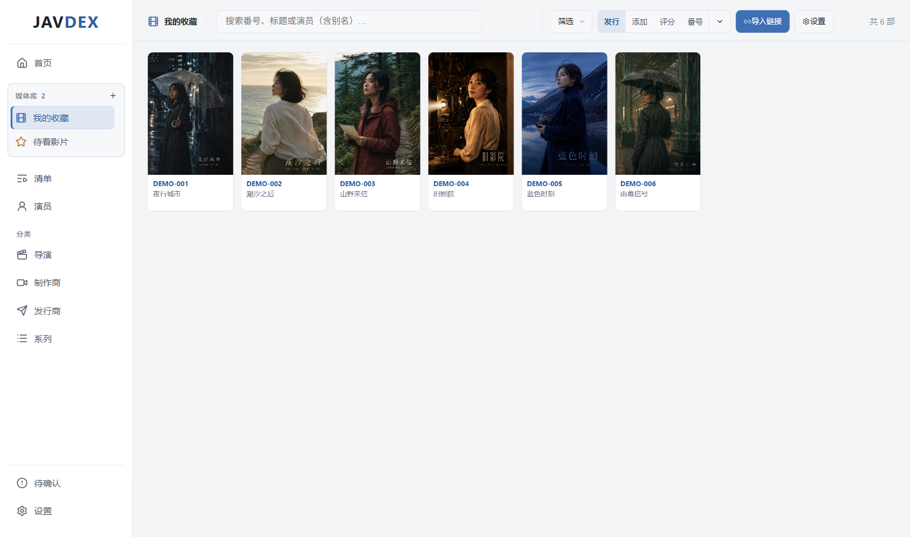
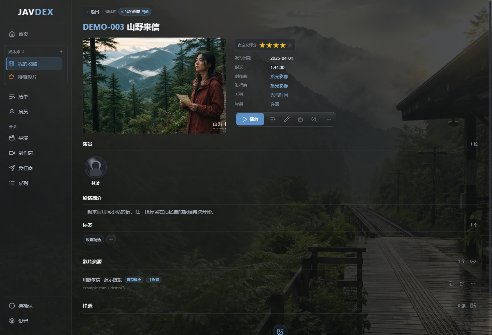

  

<h1 align="center">Javdex</h1>

  <strong>把影片文件和资源链接，整理成自己的影片资料库。</strong>

  本地优先 · 多媒体库 · Windows / macOS / Linux

  
  
  

  <a href="https://github.com/JavdexLabs/Javdex/releases/latest">下载最新版</a>
  &nbsp;·&nbsp;
  <a href="docs/USER_GUIDE.md">使用指南</a>
  &nbsp;·&nbsp;
  <a href="CHANGELOG.md">更新日志</a>
  &nbsp;·&nbsp;
  <a href="https://javdexlabs.github.io/Javdex/">访问官网</a>

Javdex 是一款以番号为核心的本地影片管理工具。扫描目录、补齐封面与资料，按演员、厂商和系列浏览，也可以创建清单、导入网页收藏，并通过 NFO 与其他媒体软件交换资料。

  

本页配图截取自当前软件，影片、人物与图片均为虚构演示资料。

## 整理与浏览媒体库

让分散在不同目录里的影片，有一个统一的浏览入口。

- **按需要分库**：创建多个媒体库，各自设置来源目录、扫描周期和默认刮削来源；首页汇总近期添加、随机发现与跨库搜索。
- **统一管理资源**：扫描本地视频与 STRM 文件，也可添加直链、网页、Magnet 和 ED2K 链接；同一影片可关联多个资源，并选择优先打开的主资源。
- **快速找到影片**：搜索番号、标题或演员，组合筛选与排序，按演员、标签、制作商、发行商、导演和系列继续浏览。

## 补齐影片资料

把只有文件名的影片，整理成有封面、简介和关联资料的条目。自动获取这些信息的过程，在应用中称为“刮削”。

- 获取标题、简介、发行日期、评分、演员、标签、封面与样张；支持单部处理和批量刮削，批量任务可暂停、恢复或取消。
- 按字段选择资料来源，例如标题和简介使用一个插件，图片使用另一个插件；更新时可选择需要处理的字段及更新方式。
- 随时手动编辑资料、添加相关网页链接，或记录自己的评分。

  

可导入更多刮削插件，也可使用开发助手辅助创建和调试插件。内置 MetaTube 来源需要连接自己的服务，配置方式见 [MetaTube 指南](docs/METATUBE_SETUP.md)。

## 从作品找到演员与系列

演员、厂商、导演和系列都有自己的资料与关联作品，方便沿着感兴趣的人物和分类继续探索。

- 维护演员头像、别名、简介与写真，在演员详情中浏览出演作品。
- 在本地识别人脸并调整头像构图，支持批量处理，也能筛选未检测到人脸的头像进行检查。
- 维护分类资料、别名和系列层级，合并重复的演员或分类记录。

## 用清单整理收藏

清单可以跨媒体库收录影片，用来整理专题、收藏或之后想看的作品。

- 自己创建清单、维护封面和相关链接，把不同媒体库的影片放在一起。
- 借助 AI 从网页导入外部清单，匹配资料库中的已有影片；遇到同番号的多个候选时，由你核对选择。
- 尚未收录的条目可按选项创建为无资源影片，先保存资料，之后再添加资源。清单导入不会下载影片。

## AI 辅助采集，疑问集中确认

在影片或演员详情中使用“Agent 刮削”，粘贴详情页地址，让 AI 从网页提取资料；预览结果、选择字段后再应用。

扫描归属不明、文件名与 NFO 番号冲突、刮削出现多个候选或演员名称冲突时，可到“待确认”集中处理。需要整理已有记录时，也可以合并同番号影片或拆分关联资源。

AI 采集、外部清单导入和插件开发助手需要先配置可用模型服务。普通扫描、浏览和插件刮削不要求配置 AI 模型。

## 让已有资料继续用起来

扫描首次发现资源时，可读取影片旁的本地 NFO，利用已有资料和图片建库；已刮削成功的影片不会被自动覆盖。

已覆盖 **Movie_Data_Capture（MDC）、MDCx、Javinizer 和 JavSP** 的常见 NFO 字段与本地图片命名约定，方便利用这些工具整理过的资料。兼容范围基于固定版本的格式样例验证，详见 [使用指南中的导入说明](docs/USER_GUIDE.md#导入已有资料)。

也可以导出影片资料、封面和可选图片附件，供 Kodi、Jellyfin、Emby、Plex NFO Agent 或 Infuse 使用。导出前可预览文件，默认跳过已有文件。

NFO 导入与导出是一次性操作，不会持续同步，也不等于完整资料库备份。不同软件的设置要求与图片支持范围见 [NFO 兼容性说明](docs/NFO_COMPATIBILITY.md)。

## 本地存储与个性化显示

- **资料留在本机**：数据库、设置和下载的图片默认保存在设备中；可在设置中迁移图片目录或启用图片加密。
- **按场景保护显示**：隐私模式可遮盖封面、样张和写真，替换演员头像，并按需关闭图片预览。
- **按喜好调整界面**：选择主题、横竖封面显示和详情背景，调整头像构图。

本地优先指资料的保存方式。联网刮削会访问对应来源，AI 功能会把任务所需内容发送给配置的模型服务；本地人脸检测无需上传图片。图片加密仅覆盖图片文件，隐私模式仅改变界面显示。

## 下载与开始使用

从 [官网](https://javdexlabs.github.io/Javdex/) 或 [GitHub Releases](https://github.com/JavdexLabs/Javdex/releases/latest) 下载对应平台的安装包。

| 平台 | 安装包 |
|---|---|
| Windows（x64） | EXE 安装版、ZIP 免安装版 |
| macOS | Apple Silicon DMG、Intel DMG |
| Linux（x86_64） | AppImage、DEB |

首次使用：

1. **创建媒体库**：在“设置 → 媒体库”新建媒体库，选择影片所在目录。
2. **扫描影片**：创建时选择立即扫描，或在媒体库设置中手动启动扫描。
3. **补齐资料**：在“设置 → 刮削来源”选择可用来源，再对影片执行单部或批量刮削。
4. **开始整理**：浏览影片和演员、加入清单；有待确认项时，核对后再完成关联。

安装与更新方式、链接导入和各项功能的具体步骤见 [使用指南](docs/USER_GUIDE.md)。

> 当前安装包尚未进行商业代码签名，系统可能显示发布者或安全提示。请从项目官网或 GitHub Releases 下载。应用可检查版本，但更新需要重新下载安装包。

## 帮助与参与开发

| 我想…… | 查看 |
|---|---|
| 开始使用、管理资源或排查操作问题 | [使用指南](docs/USER_GUIDE.md) |
| 连接自己的 MetaTube 服务 | [MetaTube 配置指南](docs/METATUBE_SETUP.md) |
| 了解 NFO 对其他软件的支持范围 | [NFO 兼容性说明](docs/NFO_COMPATIBILITY.md) |
| 从源码运行、开发插件或参与贡献 | [开发指南](docs/DEVELOPMENT.md) |
| 查看版本变化 | [更新日志](CHANGELOG.md) |

发现问题或有功能建议，欢迎 [提交 Issue](https://github.com/JavdexLabs/Javdex/issues/new)；已有计划和讨论见 [Issues](https://github.com/JavdexLabs/Javdex/issues)。

Javdex 管理你已有的影片文件、手动添加的资源链接和影片资料，不提供、托管或分发媒体内容；播放或打开链接由系统默认应用处理。使用第三方来源时，请遵守所在地法律法规及目标网站条款。第三方项目与许可见 [第三方说明](docs/THIRD_PARTY_NOTICES.md)。

## License

Javdex 基于 [MIT License](LICENSE) 开源。

Copyright (c) 2026 Javdex
