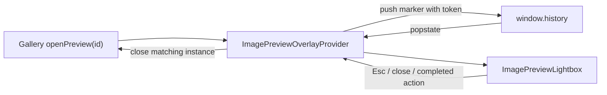

# 图片预览与历史栈修复设计

本文说明 `ImagePreviewLightbox` 为什么依赖浏览器历史栈、macOS 闪退问题的成因，以及在保留原有返回交互的前提下如何修复。

> 实施状态：方案已落地。历史项由 `ImagePreviewOverlayProvider` 协调，图片预览实例使用唯一 token，Lightbox 已通过 Portal 渲染到 `document.body`。

## 1. 原有功能意图

Lightbox 是覆盖当前详情页的临时界面，不是一个独立业务页面，但桌面应用仍需要支持用户已有的“返回”习惯：

- 按 `Esc` 关闭预览；
- 点击关闭按钮关闭预览；
- 点击鼠标返回键关闭预览；
- macOS 双指返回手势关闭预览；
- 系统或浏览器“后退”先关闭预览，而不是离开当前影片/演员详情；
- 主动关闭预览后，不能在历史栈里留下一个需要再次后退的空条目。

当前实现通过打开预览时执行 `history.pushState()`，给当前 URL 增加一个临时历史项；用户后退时触发 `popstate` 并关闭预览；点击关闭按钮或按 Esc 导致组件卸载时，再调用 `history.back()` 消费临时历史项。

该设计的核心意图是正确的：**Lightbox 是详情页之上的一层，因此返回操作应先弹出这一层。** 问题不在是否使用历史栈，而在历史栈写操作与 React 组件生命周期绑定得过紧。

## 2. 当前实现的问题

相关代码位于 `src/renderer/src/components/ImagePreviewLightbox.tsx`：

```ts
useEffect(() => {
  window.history.pushState({ avImagePreview: true }, '', window.location.href)

  const onPopState = () => onClose()
  window.addEventListener('popstate', onPopState)

  return () => {
    window.removeEventListener('popstate', onPopState)
    if (isImagePreviewHistoryState(window.history.state)) {
      window.history.back()
    }
  }
}, [onClose])
```

### 2.1 Effect 清理不等于用户关闭

Effect cleanup 可能由多种原因触发：

- 用户确实关闭 Lightbox；
- React StrictMode 的开发期副作用检查；
- `onClose` 引用变化导致 Effect 重建；
- Fast Refresh；
- 父组件重挂载；
- 路由树重组。

这些情况中只有第一种应该修改历史栈。当前代码把所有 cleanup 都当作真实关闭，因此会产生错误的 `history.back()`。

### 2.2 StrictMode 与异步 `popstate` 竞态

Renderer 入口启用了 `React.StrictMode`。开发环境首次挂载 Effect 时可能经历：

```text
第一次 setup：pushState(marker A)，注册 listener A
模拟 cleanup：移除 listener A，history.back()
第二次 setup：重置 suppress ref，pushState(marker B)，注册 listener B
第一次 back 的异步 popstate 到达 listener B
listener B 调用 onClose()
```

在 macOS Electron/Chromium 中，`history.back()` 与 `popstate` 的消息调度更容易落在第二次 setup 之后，因此表现为 Lightbox 出现一帧后立即关闭。Windows 上没有复现并不代表逻辑安全，只说明事件时序不同。

### 2.3 布尔 marker 无法区分预览实例

当前历史状态只有：

```ts
{ avImagePreview: true }
```

它无法判断收到的 `popstate` 属于哪一次打开，也无法区分旧 cleanup、当前预览和其他 overlay 的历史操作。

### 2.4 多个历史栈使用者缺少协调

项目中的 `PluginDevLeaveGuard` 也会调用 `pushState()` 并监听 `popstate`。两个组件分别直接操作全局历史栈，缺少统一的优先级和所有权规则。未来新增 modal 返回行为后，冲突概率会进一步增加。

## 3. 修复目标

修复后必须保持：

1. 系统后退、鼠标返回键和 macOS 返回手势关闭当前预览。
2. Esc、关闭按钮、删除当前图片和“设为背景”后的关闭正常工作。
3. 关闭预览不会离开当前详情路由。
4. 切换缩略图不会新增历史条目。
5. StrictMode、Fast Refresh 和父组件重渲染不会产生 `history.back()`。
6. 连续快速打开、关闭、再打开时，旧 `popstate` 不得关闭新实例。
7. 与 `HashRouter`、详情返回栈和 `PluginDevLeaveGuard` 共存。

## 4. 推荐架构

将历史栈所有权从 `ImagePreviewLightbox` 移到稳定的 `ImagePreviewOverlayProvider`，新增一个 history-backed overlay 协调器。Lightbox 只负责显示和调用 `requestClose()`，组件 cleanup 不再修改历史栈。



### 4.1 每次打开使用唯一 token

历史状态必须保留 React Router 已有字段，并附加唯一实例 token：

```ts
interface ImagePreviewHistoryMarker {
  token: string
  kind: 'image-preview'
}

const nextState = {
  ...window.history.state,
  avOverlay: {
    kind: 'image-preview',
    token: crypto.randomUUID()
  }
}
```

不能用固定布尔值，也不能覆盖 `window.history.state` 中 HashRouter/React Router 使用的 `key`、`idx` 或 `usr` 字段。

### 4.2 在打开动作中创建历史项

`pushState()` 应由明确的 `openPreview()` 用户动作触发，而不是由 Lightbox mount Effect 触发：

```ts
function openPreview(assetId: number): void {
  const token = crypto.randomUUID()
  pushOverlayHistoryMarker(token)
  setPreview({ assetId, token, phase: 'open' })
}
```

事件处理函数不会被 StrictMode模拟执行，因此不会产生重复 marker。

### 4.3 Provider 只安装稳定的 `popstate` listener

Provider 可以在 Effect 中注册和移除 listener，因为 listener cleanup 不修改历史栈：

```ts
useEffect(() => {
  const onPopState = (event: PopStateEvent) => {
    const current = previewRef.current
    if (!current) return

    const marker = readImagePreviewMarker(event.state)
    if (marker?.token === current.token) return

    closePreviewState(current.token)
  }

  window.addEventListener('popstate', onPopState)
  return () => window.removeEventListener('popstate', onPopState)
}, [])
```

listener 使用 ref 读取当前实例，避免因回调引用变化反复安装。

### 4.4 区分“历史后退关闭”和“主动关闭”

关闭入口统一进入 Provider：

```ts
type PreviewCloseSource = 'history' | 'escape' | 'button' | 'action' | 'route'
```

- `history`：历史项已经被用户弹出，只清理 React 状态，不能再次 `history.back()`。
- `escape/button/action`：若栈顶仍是当前 token，则调用一次 `history.back()`；等待匹配的 `popstate` 清理 UI，或先把 UI 标为 `closing` 防止重复操作。
- `route`：优先清理 overlay 状态；路由导航流程负责自己的历史变化，不能额外后退到上一个业务页面。

建议主动关闭时以 `popstate` 作为最终提交点：

```ts
function requestClose(source: PreviewCloseSource): void {
  const current = previewRef.current
  if (!current || current.phase === 'closing') return

  if (source === 'history' || source === 'route') {
    closePreviewState(current.token)
    return
  }

  if (historyHasToken(current.token)) {
    markClosing(current.token)
    window.history.back()
  } else {
    closePreviewState(current.token)
  }
}
```

需要增加短超时兜底，例如 300 ms 内没有收到 `popstate` 时仅关闭 UI；兜底不能再执行第二次 back。

### 4.5 忽略过期事件

所有异步回调必须核对 token：

```ts
if (eventToken && eventToken !== previewRef.current?.token) return
```

旧实例产生的 `popstate`、定时器或异步图片操作不能关闭新实例。

## 5. Portal 调整

历史竞态是本次闪退的首要原因，但 Lightbox 当前仍渲染在详情页 DOM 内。详情区域包含 container containment、滚动容器和多层 `overflow: hidden`，macOS 的合成层实现对 `position: fixed + backdrop-filter` 更敏感。

修复时应同时使用 `createPortal` 将 Lightbox 渲染到 `document.body`：

```tsx
return createPortal(lightbox, document.body)
```

Portal 不改变历史功能，但可以保证：

- `position: fixed` 始终相对应用视口；
- 不受详情容器裁剪和 stacking context 影响；
- macOS 与 Windows 的合成行为更一致；
- z-index 只需要与全局 toast/modal 协调。

## 6. 与现有模块的职责划分

建议调整为：

```text
useImagePreviewById
  - 保存当前 assetId
  - 根据 items 解析 index
  - 不直接调用 History API

ImagePreviewOverlayProvider / useHistoryBackedImagePreview
  - 创建唯一 token
  - pushState
  - 监听 popstate
  - 区分关闭来源
  - 协调 route change

ImagePreviewLightbox
  - 图片切换、缩放、拖拽和工具栏
  - 通过 Portal 渲染
  - 调用 requestClose(source)
  - cleanup 不操作历史栈
```

如果未来多个 overlay 都需要返回行为，应进一步抽象为通用 `OverlayHistoryCoordinator`，以栈结构管理 `image-preview`、确认弹窗和 leave guard。第一阶段不必一次重构所有 overlay，但 marker 格式应预留 `kind`。

## 7. 不推荐方案

### 删除 History API

能消除闪退，但会丢失 macOS 手势和鼠标返回键关闭预览的原功能，不满足本次目标。

### 关闭 React StrictMode

只能隐藏开发期复现，无法消除 Effect 重建、Fast Refresh 和异步 `popstate` 的竞态。

### 在 cleanup 中增加延时或平台判断

例如 `setTimeout(history.back)` 或 `process.platform !== 'darwin'` 都依赖时序，无法建立历史项所有权，且会制造新的跨平台差异。

### 只增加 suppress 布尔值

布尔值无法识别预览实例。第二次 setup 会重置它，旧事件仍可能命中新实例。必须使用唯一 token。

## 8. 测试方案

### 单元测试

对 history 协调器注入可控适配器，覆盖：

1. 打开一次只 push 一个 marker。
2. Effect setup/cleanup 两次不改变历史长度。
3. 用户后退只关闭 UI，不再次 back。
4. Esc/按钮关闭只 back 一次。
5. 旧 token 的事件不关闭新预览。
6. 当前 marker 已丢失时主动关闭不 back。
7. marker 合并时保留 Router state。
8. route source 关闭不额外 back。

### 组件测试

- 点击样张打开预览。
- 切换缩略图不增加历史项。
- Esc 和关闭按钮行为一致。
- “设为背景”完成后正确关闭。
- 删除当前资源时正确关闭。

### macOS 手工回归

必须在开发构建和正式打包构建分别验证：

1. 连续快速打开/关闭样张 20 次，无闪退。
2. 双指返回关闭预览但保留详情页。
3. 鼠标返回键关闭预览但保留详情页。
4. 预览关闭后再次返回，才离开详情页。
5. 打开预览后切换多张图片，再返回仍只关闭一次。
6. 深色/浅色主题下 Portal 层级、背景和工具栏正常。

Windows 至少回归鼠标返回键、Alt+Left、Esc 和关闭按钮；Linux 回归 Alt+Left 与 Esc。

## 9. 实施顺序

1. 为 history 操作建立可注入适配器和纯状态机测试。
2. 将打开/关闭历史管理迁入 `ImagePreviewOverlayProvider`。
3. 删除 Lightbox 内的 history Effect 和 suppress ref。
4. 将 Lightbox 改为 Portal。
5. 回归影片样张、演员写真、影片封面和演员头像四个入口。
6. 完成 macOS 开发/打包双环境测试后再合并。

## 10. 验收标准

修复完成必须同时满足：

- macOS 点击图片预览不再闪退；
- 返回手势仍优先关闭预览；
- 主动关闭不会跳离当前详情；
- 一个预览实例只对应一个临时历史项；
- Lightbox mount/unmount cleanup 中不存在 `pushState()`、`back()` 或 `forward()`；
- 所有历史事件以实例 token 判断所有权；
- 完整类型检查、路由测试和跨平台手工回归通过。
