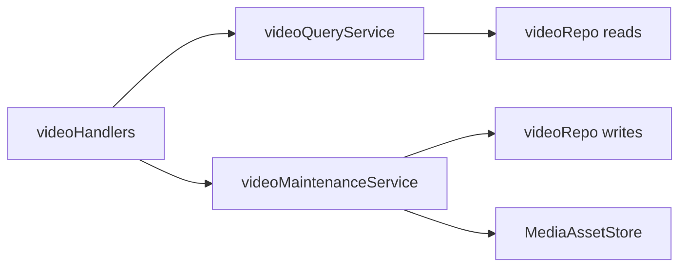

# ADR-0011：影片 application use-case seams

影片 IPC 入口曾集中在一个 17 方法的 `videoApplicationService`：几乎全部是对 `videoService` / `videoRepo` 的转发（大量 `return true`），宽 façade 抹平了深度差异。完成线 B 按 use-case 收窄为两条 seam，并把原先 `videoService` 自由函数收成显式 maintenance interface；**不拆** `videoRepo`，也不把刮削 apply 并入 IPC 线。

## 两条 seam

1. **`videoQueryService`**（[`videoQueryService.ts`](../../apps/desktop/src/main/services/videoQueryService.ts)）
   - 拥有：列表、详情（含显示时长派生）、年份列表。
   - 不拥有：写库、资源清理、刮削 apply。

2. **`videoMaintenanceService`**（[`videoMaintenanceService.ts`](../../apps/desktop/src/main/services/videoMaintenanceService.ts)）
   - 拥有：编辑 / 清元数据 / 删除、样张与海报、影片资源设主与移除、番号纠正、手动标签、累计刮削成功标记、部分字段更新与评分。
   - Policy 示例：`edit` / `clearMetadata` / `delete` / 样张路径经 `MediaAssetStore` coordinator；番号纠正在缺少本地资源时可合并到已有番号。

[`videoHandlers.ts`](../../apps/desktop/src/main/ipc/videoHandlers.ts) 只做 typed adapter，分别委托上述两条 seam。`check-actress-boundaries` 白名单锁定该接线。

## 必须保持的 invariants

- 数据库 module 不触碰 `MediaAssetStore` / 文件系统。
- 媒体写入与清理经 `MediaAssetStore` 公开面（含 coordinator）。
- 不恢复宽 `videoApplicationService` 聚合 façade，也不保留平行的 `videoService` 自由函数袋。
- 刮削 download / plan / apply 仍由 scrape host（`scraperManager` 等）拥有，不经本 ADR 的 IPC seams。
- 本 ADR 刻意不做 `videoRepo` 物理分组。

