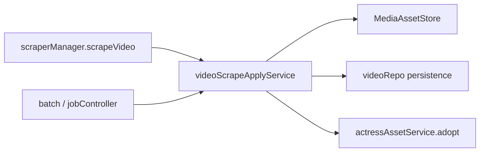

# ADR-0012：影片刮削 apply / 图片写入 seam

影片刮削交割曾拆在三处：`scraperManager.scrapeVideo` 负责下载与双编排，`videoRepo.plan/apply` 拥有 fillEmpty 矩阵与写库，`videoImageAvailability` 做薄胶水。领域概念 **影片图片字段写入** 与 **影片刮削应用结果** 没有落在同一 deep module 后。

## 决策

新增 [`videoScrapeApplyService`](../../src/main/services/videoScrapeApplyService.ts)：

1. 拥有 `resolveEffective` / `plan` / `apply` 政策与交割 SQL。
2. 拥有下载 + 两次 `coordinateDatabaseChange` + 失败清理 + 演员头像 adopt（best-effort）。
3. 吸收并删除浅层 `videoImageAvailability`；batch targets 的 `missingFields` 过滤只经 `resolveVideoBatchTargets`。
4. `scrapeVideo` 仅作 parse/runner，调用 `deliverParsedResult`。

[`videoRepo`](../../src/main/db/videoRepo.ts) 保留路径候选、`markScrape*`、batch SQL where；**不再**内含 fillEmpty 矩阵或 `listVideosForBatchScrape` 的 missingFields 政策过滤。

## 必须保持的 invariants

- 下载与写库分两次编排（ADR-0006）：committed video 行不得与 media-ledger rollback 配对；apply 失败清理下载集。
- 数据库 module 不触碰 `MediaAssetStore` / 文件系统。
- 不把单项 scrape 再拆成 `SingleScrapeService`（ADR-0007）。
- 不把 scrape apply 绑入 `videoMaintenanceService` IPC seams（ADR-0011）。
- 不恢复 `videoRepo` 内的 plan/apply 矩阵。

