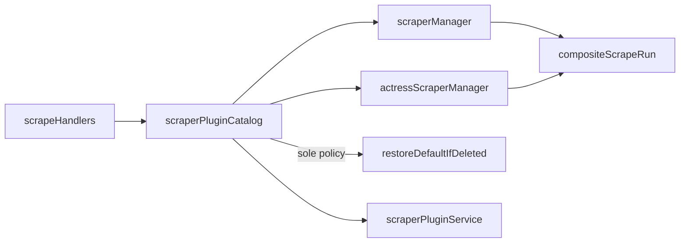

# ADR-0013：共享 composite scrape-run / plugin catalog seams

影片与演员 scrape host 曾各自复制「user-over-bundled registry」与「按 `fieldPluginMap` 分组跑插件 → pick → merge」循环；`scraperPluginCatalog` 则是几乎纯转发的 IPC 适配层，唯一政策是删除后恢复默认刮削器。

## 决策

1. 新增 [`compositeScrapeRun.ts`](../../apps/desktop/src/main/scrapers/compositeScrapeRun.ts)：
   - `buildPluginRegistry`：user 覆盖 bundled。
   - `runCompositeFieldGroups`：字段分组编排；用 `onPluginError: 'abort' | 'collect'` 保留 video（失败上抛）与 actress（部分失败 warnings，全失败 throw）行为差。
2. [`scraperManager`](../../apps/desktop/src/main/scrapers/scraperManager.ts) / [`actressScraperManager`](../../apps/desktop/src/main/scrapers/actressScraperManager.ts) 只保留 domain pick/merge、host 编排与 apply/conflict 接线。
3. [`scraperPluginCatalog`](../../apps/desktop/src/main/services/scraperPluginCatalog.ts) 明确为 **kind 路由适配器**；**唯一拥有的政策**是 `restoreDefaultIfDeleted`。install/export/composite CRUD 仍在 `scraperPluginService`。

## 必须保持的 invariants

- video composite：插件错误不吞掉；无匹配结果时 host 走「未找到」。
- actress composite：单源失败写 warning；分组非空且全部 throw 时整体失败。
- domain pick/merge/normalize 不进入共享模块。
- 不把 apply / identity conflict / asset 下载拉回 host 的 composite 循环。

## 明确不做

- 不引入 `SingleScrapeService`（ADR-0007）。
- 不改 `scrapeBrowser` / batch lifecycle / `videoScrapeApplyService`。
- 不强迫 plugin-dev dry-run 走 composite。
- 不合并 video/actress 双套 scrape IPC。
- 不重写或拆分 `scraperPluginService` 生命周期实现。
