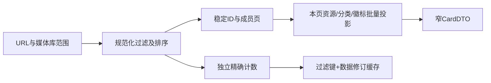

# 大媒体库优化落地计划（Issue #100）

基线 `dev / 4c953a9`；日期 2026-09-10。本文保留下一版本的完整实施方案与验收要求；工作区已实现多个批次，整套15个工作包/42项风险仍未验收，也未承诺发布日期。证据见[主审计](large-library-performance-audit.md)、[后台](large-library-background-audit.md)、[UI](large-library-ui-audit.md)与[原始基准](large-library-results/README.md)。不直接采用用户修改版，也不要求用户用 AI 改生产库。

2026-09-11 用户收敛范围：完成当前 NFO 相关优化、统一验收并完整更新计划后停止。以下完整路线图作为后续待办保留，不代表继续执行的授权；当前代码、证据和剩余项见[实施与验收记录](large-library-implementation-status.md)。历史批次的“尚未实施”以最新记录为准。

PERF-04 的最新诊断见[统计维护与手工标签复核](large-library-statistics-probe.md)：已消除1万缺统计夹具中手工标签外连接的秒级退化，但30万有统计聚合仍慢。后续恢复PERF-04时，应结合已有关系索引、窄名称接口和查询隔离证据决定统计维护；不得把探针中的 optimize 直接搬到同步启动路径。

## 1. 决策和实施原则

- 首批优先减少不必要的工作量、修复可触发规模失败的结构、分离徽标/元数据/列表/详情；不要先做全量搜索索引或全面换数据库。
- 目标是保持用户可操作，而不只是降低某段 SQL 的平均耗时。端到端、主进程连续阻塞、内存、I/O、写锁和正确性一起验收。
- DB/文件任务由有界队列调度，分页/批次同时限制行数和字节；异步包装同步函数、增加 Promise.all 都不算后台化。
- 读模型和缓存可重建；业务主数据、资源归属、授权、审计和恢复账本不可为提速被舍弃。所有 schema 改动走正式 migration，禁止运行时随意建删生产表或只改 user_version。
- 每个工作包独立 PR，完整说明触发场景、返回行为、兼容/恢复与验证；本次不替用户创建 Issue/PR 或发布评论。

## 2. 工作包、依赖和验收

S/M/L 表示相对改动复杂度，不是天数估计。P1 为首批，P2 为后续；详细风险 ID 对应主报告 DB/WEB、后台 BG 和 UI F。

| 工作包 | 范围、具体改动 | 依赖 / 规模 | 可审查的完成标准 |
|---|---|---|---|
| PERF-00 / P1 | 建立合成库、操作脚本、SQL/IPC计时、event-loop、FS次数/字节、heap/external/RSS、任务阶段追踪；记录运行时 PRAGMA/编译选项 | 无 / M | 覆盖本计划矩阵；数据脱敏；同一机器可重复；报告 first/warm/p95 的样本量与定义；监控开销可关闭且有测量 |
| PERF-01 / P1 | BG-01/03/11：移除 `push(...大数组)`；STRM/待确认匹配建立 Map/Set；进度按任务合并 | PERF-00 / S–M | 300k/600k 路径无参数溢出；映射查找近线性；每任务连续进度 ≤10次/秒，错误/结束即时且最终计数一致 |
| PERF-02 / P1 | F05：侧栏待确认 count DTO；收件箱 summary 分页；选中后才取候选/附件；按变更版本刷新 | PERF-00 / M | Q=10k 时徽标响应固定字段且 <16KiB；无整份 pending 轮询，count 与完成/丢弃/扫描/冲突事件一致 |
| PERF-03 / P1 | DB01/02/07：scope归一化，单库不排名；精简count、ID页与批量projection；首页recent不取total，公共状态快照去重 | PERF-00 / M | 所有筛选与排序返回ID/总数等价；页SQL只补本页资源/分类；单库EQP无多库排名；首屏热p95候选目标≤300ms（目标Windows库复核） |
| PERF-04 / P1 | DB03/04/10：标签/演员可见成员预聚合；小型名称查找不附带昂贵count；统计信息维护按空闲/大批量写后触发 | PERF-03 / M | 各计数口径明确；零关联、manual、共享/隐藏/归档/待解决名称一致；统计更新前后全查询矩阵无未解释退化；重复徽标/候选请求复用快照 |
| PERF-05 / P1 | F01/02/03/04/08：清单/演员作品集分页+虚拟化；分类/封面候选按需分页；窄CardDTO；专用演员合并候选接口 | PERF-03 / M–L | 每次普通列表≤200、演员页≤240、候选≤100；候选不传完整简介/作品；超长字段夹具仍满足约定字节预算；DOM和初始载荷不随K线性增长 |
| PERF-06 / P1 | F07/10：失效键收敛、同查询请求合并、分页缓存窗口；大选集批量预览；旧IPC结果防落地 | PERF-02/05 / M | 浏览100页+20筛选后缓存受预算控制；回退锚点/Shift选择不重不漏；只读返回不刷新全部旧页；变更可见区域及时一致 |
| PERF-07 / P1 | BG07/13、F06/09、WEB02：异步资产读取/解密，有界字节缓存+in-flight合并；分档缩略图；头像存在性查询由可维护状态替代整库FS探活 | PERF-00 / L | 图热命中可证明减少read/decode；只在预览取原图；单图/在途字节/像素有预算；缺失恢复、裁剪、替换、密文与隐私状态正确；不一次性生成全部缩略图 |
| PERF-08 / P1 | BG02/04/05/09/12：扫描预处理、尾部清理、NFO规划/应用分批让步和取消；审计逐项落盘、分页预览；启动必要恢复与GC分离；DB12全库校验/历史迁移后台化并展示进度 | PERF-01 / L | 每阶段可取消/报告进度；主线程连续同步段候选上限250ms；取消不误删离线/未枚举资源；前台NFO合同保留；退出先drain安全交割再关库 |
| PERF-09 / P1 | BG06/08/14：targets与checkpoint游标分离，批量进度增量持久化；加密别名表增量存储；Agent追加日志和游标 | PERF-00 / L | T从10k翻到20k，总checkpoint/日志写入量近线性；不每目标重写全集；断点、文件交割、授权撤销、工具幂等恢复故障注入通过 |
| PERF-10 / P1/P2 | DB/WEB主进程查询隔离：专用只读DB worker或utility、查询队列与写事务协调 | PERF-03/04 / L | 慢读不阻止窗口关闭/配对/进度；不产生无限队列；同查询合并，过期结果丢弃；读模型迁移/停机/连接关闭有顺序，WAL不持续增长 |
| PERF-11 / P2 | DB05：保持现有搜索语义的演员候选预求值、候选ID评估、条件性FTS索引和可恢复回填 | PERF-03/04/10 / L | 现有包含搜索语义回归，字符矩阵通过；索引building可用旧查询；更新/删除/改名/冲突期间无幽灵结果；中断恢复后与重建结果一致 |
| PERF-12 / P2 | DB06：深页keyset，日期空值规范化/表达式索引候选，必要时成员排序读模型 | PERF-03 / M–L | 1/1k/末页性能曲线不随OFFSET线性恶化；同值排序/页码跳转/返回锚点有明确合同；评分与日期双向排序对照通过 |
| PERF-13 / P2 | BG10/15/16、WEB03/04：大资产迁移/Agent附件流水、历史归档和保留、LAN连接/流成本预算 | PERF-07/08/09 / L | 附件常驻缓冲随并发而非全部附件增长；长期磁盘受明确可配置策略控制；active/ready引用不误清理；多设备跳播不饿死桌面查询 |
| PERF-14 / P3 | cache/mmap/temp_store、checkpoint和图缓存容量调优 | 上述热点已处理 / M | 固定硬件单变量对照，记录回读值；冷/热/写入/内存压力均衡收益；不因吞吐回退耐久性，不使用一次测试决定所有平台默认值 |

第一轮交付为 PERF-00A → PERF-01A/02A/03 → PERF-04；其余子包及完整测量矩阵按第八节逐批推进；图片慢且明显影响客户时提前 PERF-07 的读取边界。PERF-09 的数据格式变更不可用“先少写checkpoint”替代可靠恢复。后续阶段必须在首批正确性和指标达标后推进，避免同时更换查询、缓存与schema而无法归因。

## 3. 查询与缓存的具体设计

### 3.1 scoped列表拆分



- `scope.kind=all` 先求有效活动库；一个库复用现有 `kind=library`，零库返回空，多库保留原去重和首选库顺序。
- ID页返回 `videoId/libraryId/membershipAddedAt`，按最终排序完成 LIMIT。补字段只针对这一页，不能在应用内取全库再slice。
- count 不需要分类名称、资源kind列表和徽标投影；首页仅请求items时不强制count。精确total异步加载时UI显示“统计中”，不能拿估计值冒充精确值。
- 如果页和count分开，需要同一读版本/事务或可检测修订；不能在并发编辑时把两个无关快照拼成“精确一致”。不为等待用户翻页一直保持长读事务。
- 参数化SQL；巨大IN/VALUES改有界批次或临时选择集合。不要靠增加SQLite变量上限掩盖全量选择内存。

### 3.2 统计和计数

先尝试去重活动成员集合预聚合，并测默认统计/ANALYZE/倾斜关系/不同库数。不能直接把 `COUNT(DISTINCT)` 全局替换为 `COUNT(*)`。本次单库变体等价不证明多库共享、多个标签OR、manual-origin等场景等价。

`PRAGMA optimize` 的支持与行为按打包SQLite版本确定；安排在初始化非关键路径、空闲或大批量变更后。首次大库统计维护可能有I/O与写入成本，应可见、可限预算，并比较计划退化；禁止每次点击标签先ANALYZE。

物化计数表是后续选项：必须定义“全局/活动可见/单库/自定义范围”口径、原子更新、重算/差分核对和写放大。任意多库组合不适合预建所有组合的计数；可缓存有界热门范围。

### 3.3 缓存与失效

缓存键至少包含规范化范围、隐藏/归档口径、筛选、排序、页游标、结果类型和数据修订。配置/资源/成员/名称变更分别影响哪些键形成清单。元数据变更不能错误撤销授权缓存，授权撤销也不能等TTL才生效。

Web 图片若使用私有长期缓存，浏览器命中不会请求服务器，不能承诺撤销后收回已缓存内容；需要每次验证时采用条件请求（private/no-cache），不允许存储时继续 no-store。授权撤销的即时性指标限定为后续服务器请求，版本化 URL 也不能收回旧副本。

昂贵列表/年份/标签以共享服务快照减少重复，设置容量和字节上限。扫描连续更新合并失效，任务完成立即flush；取消仍保留已提交变更的失效事件。不可见query只标stale，避免在路由变化时refetch所有历史key。

无限页缓存不能只设置 `maxPages`：当前 nextOffset 依赖累计页面长度，淘汰前页会重取。需要独立cursor/absolute index、前后加载、滚动锚点和选择集合模型，再设页数/字节预算。图缓存、数据缓存、已选ID和任务日志分别计账。

## 4. Worker与数据任务边界

- 单一写入所有者或明确串行写协调，不让多个worker各自运行migration。读worker注册相同SQL函数/排序规则，配置自己的连接和缓存预算。
- UI/HTTP只传小型查询请求，worker返回有界DTO；所有SQL搬到worker后再一次返回30万对象仍会阻塞主进程和renderer。
- 初始建议一个读worker加有限排队，按实际SSD/HDD表现再增加；多worker会增加页缓存、文件句柄及争盘。请求合并、取消队列中的旧请求、in-flight上限和超时需一起设计。
- 同步SQLite中的“忽略旧结果”不是中断计算；真正查询中止需要驱动支持或worker/连接生命周期方案，并确保读者终止不破坏写事务。保留范围修订检查，避免返回已隐藏资源。
- 扫描任务以临时磁盘索引容纳全局番号/路径关系，逐批读取和应用；未完成枚举不执行缺失资源清理。NFO规划/预览分页但仍守当前前台合同和审批/物理身份要求。
- 进度IPC只是展示；持久游标和审计在后端。事件节流不能导致checkpoint丢失、关闭后队列无法恢复。

## 5. FTS与schema迁移方案

推荐顺序（按用户最新要求修订）：PERF-11A 先做演员ID预求值并评估候选ID查询；保持现有搜索框、包含匹配、大小写、通配符、名称归属、结果总数与排序，不新增精确模式，也不因番号精确命中而提前返回。PERF-11B 的 trigram 仅在剩余扫描瓶颈经测量确认后实施。不得把 MATCH 原样替换 LIKE：番号连字符、引号、空白、Unicode、大小写、`%/_` 的现有语义要以业务测试明确。trigram短于3字符的路径、contentless/external-content表的更新删除规则见[官方核对](large-library-reference-research.md)。必要时保留原查询作为结果过滤，评估候选召回/排序成本。

正式迁移：

1. 增加派生索引schema和 `building/ready/failed` 状态，保留源影片/名称为真相；不要在首窗之前一次同步回填整库。
2. 使用稳定主键游标、行数和执行时长双预算分批回填。每批与进度同事务；I/O峰值、WAL和目标索引空间估计先明确。
3. 在线写入一致性选择“协调串行写入”或“事务变更日志重放”。已删记录不得被旧回填复活，未回填记录的UPDATE/DELETE必须合法。
4. 追平增量后短屏障切ready；读路径按revision选择；失败维持旧查询，允许安全清理重建。搜索可用不代表索引完整，需要差分ID集合验证。
5. 迁移前由正式版本升级机制落实可恢复备份/快照策略，磁盘满或校验失败保留可恢复状态；不通过降 `user_version` 伪装回退。回退明确为关闭新读路径/恢复备份/前向修复哪一种。
6. 老版本应用对新schema的策略明确提示，不鼓励删除数据库；本次不增加数据库版本号，也不预先指定下一schema编号。

索引改动也会提高导入/刮削/删除成本。每次必须同时测每秒写入量、事务时长和磁盘增长；额外索引能否同时覆盖WHERE与实际ORDER BY由EQP验证。

## 6. 指标与实验矩阵

以下为**建议验收目标，尚未证明达到，也不是对所有HDD的承诺**。先在目标Windows基线上校准后冻结门槛，不在测试后降低目标以伪装通过。

| 指标 | 初始候选门槛与口径 |
|---|---|
| 列表/首页热响应 | 30万目标库端到端p95≤300ms（DB+IPC+首屏稳定渲染）；冷盘另报，不混算 |
| 搜索 | 输入防抖结束至稳定结果p95≤500ms；完整番号输入（仍按包含规则）p95≤150ms；短词和无结果单独报告 |
| 主进程交互 | 后台任务运行时event-loop delay p99≤100ms；最长同步段≤250ms；若I/O不可控需隔离而非略去异常值 |
| 分页载荷 | 常规影片≤200条/页、演员≤240条/页、候选≤100；CardDTO候选预算≤512KiB/页，徽标summary<16KiB |
| DOM/缓存 | 主列表DOM受视口+overscan约束；30/100页及20筛选后页缓存预算固定，长简介/大关联不突破载荷合同 |
| 图片 | 热命中读/解码次数可核查下降；原图与缩略图分开；明确字节/像素/并发限制，无跨图过期错误 |
| 取消/退出 | 1秒内显示已接收取消并阻止新工作；完成当前原子交割和真正停止时延另记，不能承诺系统调用立即中断 |
| 批任务 | T翻倍时持久化总字节和关联匹配次数接近线性；进度≤10次/秒/任务，final flush零丢失 |
| 长时间运行 | 8小时浏览/扫描/刮削组合，heap/external/RSS与WAL/历史增长可解释；无未完成任务时不持续单调增长 |

数据矩阵：

- 规模：10k、100k、300,382、600k；演员10k/50k、标签1k/20k，关系均匀/热门集中；1/10/50库及0%/30%/90%重叠；清单200/10k/30万成员；待确认0/1k/10k。
- 内容：长简介/多别名、NULL/空白日期、同评分、单片多资源/多图片；普通非敏感色块图、损坏/缺失/恢复、明文/密文；不需要真实30万视频文件。
- 硬件：Windows x64 SSD与HDD至少各一台；受限内存；目录与DB同盘/异盘；网络盘为单独扩展场景，不混入本地盘均值。Mac只作开发对照。
- 状态：fresh迁移/历史升级、无统计/有统计/过期统计、空闲/扫描/刮削/导出并发、1/4/10浏览器、随机跳播与密集图片请求。
- 操作：首窗、首屏、连续翻页/末页、全文/短词/番号/演员查询、改名/隐藏/移库/删除、切窗/返回/筛选切换、暂停恢复、网络根失联、磁盘满、重启。
- 数据正确性：原查询/候选查询对照ID与顺序、count口径、索引回填期间更新/删除/冲突、缓存失效、撤销授权对后续服务器请求立即生效、引用文件不误删。

测量方法：每个固定场景预热后至少30次，端到端p50/p95/max、事件循环p99、IPC/SQL次数、页扫描计划、FS次数/字节、写锁、WAL大小和内存分开采集。必须报告样本数与分位计算；不把本次3次热样本升级为p95。冷缓存控制方法具体记录，进程重启不等于清空OS缓存。避免性能测试读写客户原库。

## 7. 发布门槛、回退与协作

1. PERF-00先建立现状；每包只改变一个主要机制，保存前后原始结果和SQL计划，验证收益来自目标路径。
2. 按影响范围运行现有测试：scoped/home/tag/actress/playlist、路由/选择/虚拟网格、扫描/生命周期、NFO/资产、批队列、Agent恢复、Web认证/媒体边界。最终按仓库规范执行 `npm test`、构建与隔离Electron/浏览器冒烟。
3. 至少一次Windows大库验证、一次升级/取消/磁盘满/重启故障注入。只跑小库单元测试不能宣称30万库问题解决。
4. 新查询/缓存/后台读取路径分开控制回退开关，默认状态与升级切换有记录；回退查询不回滚用户后续业务写入。关闭派生索引使用不等于自动删schema。
5. 调整 `synchronous` 必须单独说明耐久性，不把NORMAL等同断电不丢数据；mmap和MEMORY参数无稳定收益时不发布。
6. 发布说明只写用户可见收益、限制和必要升级信息，不把开发过程每个临时错误作为功能修复列表。#100更新由维护者在实际验证后发布，本报告没有代发。

交付分工建议：数据库/主进程负责人负责PERF-03/04/10/11/12，UI负责人负责PERF-02/05/06，文件/任务负责人负责PERF-01/07/08/09/13，共享PERF-00结果与正确性合同。避免各模块分别引入互不相容的DB连接、缓存revision或任务恢复格式。


## 8. 实际执行批次与合入顺序

截至本计划更新，只有审计、合成基准及 SQL 隔离实验完成；所有生产优化均为**待实施**。以下是执行顺序，不将计划中的测试命令或验收目标标为已通过。当前基准仍缺 UI/FS/故障注入数据，PERF-00 不可整体勾选完成。

| 批次 | 执行范围与拆分 | 开始条件 | 交付和退出条件 |
|---|---|---|---|
| A：建立可比较基线 | PERF-00A：固化当前脚本、补小型业务正确性夹具、记录每次基线 SHA/运行环境/结果；PERF-00B：随后随各批补端到端、FS、并发和 Windows 矩阵 | 当前 dev，保留本次审计原始结果 | 00A 有可重复命令和候选/原实现差分；先不等待全部硬件矩阵才能开始开发，发布仍受第七节约束 |
| B：首批规模与查询修复 | 并行 01A（消除大数组实参）、02A（徽标 count）、03（scope/count/ID页/首页）；03 后做 04（聚合与统计） | 00A；03/04 串行避免同 repo 冲突 | 300k 路径无已确认参数溢出；徽标不加载候选详情；目录/首页/聚合保存前后 EQP 和语义差分；未达响应目标继续定位，不直接宣布解决 #100 |
| C：控制前台返回与图片工作量 | 02B（收件箱概要页）、05（清单/演员/分类与候选分页）、06（缓存/失效/选择）；07A（异步图片读取及缓存）可与 B 并行，07B（缩略图/头像状态）随后 | 05 依赖03的页面合同；06依赖02B/05；07需要00B的读/解码测量 | 无完整大清单/待确认详情旁路；深浏览 DOM/缓存受限；卡片热图减少真实读取；数据更新与返回锚点正确 |
| D：后台任务与持久格式 | 01B（匹配索引/进度合并）、08A（扫描/NFO/审计流式化）、09A（批量checkpoint）、09B（加密别名）、09C（Agent日志）；10（读查询隔离） | 各子包先有对应故障/取消测量；10依赖03/04；格式变更各自独立 PR | 单包恢复测试通过后再启用新格式；不以减少落盘频率替代可靠恢复；读 worker 排队/退出/WAL有界 |
| E：启动及长尾场景 | 08B（启动校验/历史迁移/退出协调）接续10的连接生命周期设计；13A（资产迁移/附件）、13B（历史保留/恢复）、13C（LAN查询与流预算） | 08A/09/10；13各子项按实际共享接口依赖推进 | 首窗可展示受限进度，校验完成前不开放依赖库的业务；安全交割/离线根/授权撤销/磁盘满验证通过；长期增长可解释 |
| F：搜索、深页与容量调参 | 11A（精确番号与演员候选）、12（keyset/排序）；11B（FTS）由剩余搜索瓶颈触发；14按证据选择参数 | 03/04稳定；11B依赖10；12与06共同定义游标/返回合同 | 搜索/深页对照符合原语义；FTS与参数无收益可明确拒绝采用，不能仅凭“暂缓”关闭风险；每项保留决策与剩余限制 |

PERF-00A 是后续工作包表中 PERF-00 的开发前置；PERF-00B 是跨批次持续建设的发布证据。标为子包仅拆执行，不减少父包范围。第一轮开发可以在 Mac 合成库推进；缺 Windows/HDD 证据时状态是“开发验证完成，目标环境待验收”，不能标整个性能目标完成。

推荐按独立可审查改动使用 `codex/perf-<编号>-<主题>` 分支，以最新远程 dev 为基线；开始前检查工作区和远程状态，保留本次未提交报告。此处只约定后续操作，未创建分支、提交、推送或发布 Issue。Issue/PRD 正式跟踪仍遵循 [仓库约定](../agents/issue-tracker.md)，后续获准创建工单时链接本设计，避免另建重复的本地 Issue 系统。

### 8.1 首批修改入口和验证内容

| 子包 | 主要入口 | 必须补足的验证 |
|---|---|---|
| 00A | [基准脚本](../../scripts/performance/large-library-benchmark.ts)、[原始结果](large-library-results/README.md) | 保存基线，不覆盖历史结果；新场景补活动/归档/隐藏/多库重叠、空集合、同分/空白日期和高扇出；计时与 JSON/渲染开销分开 |
| 01A | [scanner](../../src/main/scanner/scanner.ts)、[scanCoordinator](../../src/main/scanner/scanCoordinator.ts) | 覆盖300k/600k输入实际汇总函数、输出顺序与重复项语义；使用合成路径，无需创建数十万媒体文件；仅表达式不再作为最终完成证据 |
| 02A | [pendingRepo](../../src/main/db/pendingVideoScrapeRepo.ts)、[scrapeHandlers](../../src/main/ipc/scrapeHandlers.ts)、[preload](../../src/preload/index.ts)、[Layout](../../src/renderer/src/components/Layout.tsx) | 专用count贯通共享类型/IPC/服务/UI；10k候选详情不被读取；确认/丢弃/扫描变更后徽标一致；失败与加载态不冒充0 |
| 03 | [scopedRepo](../../src/main/db/scopedVideoCatalogRepo.ts)、[homeRepo](../../src/main/db/homeDiscoveryRepo.ts)、[mediaLibraryHandlers](../../src/main/ipc/mediaLibraryHandlers.ts) | 先确认 JOIN 基数再去重移除；逐组合对照ID、顺序、total、资源归属；单库范围归一化与多库首选规则；后补投影只读当前页 |
| 04 | [tagRepo](../../src/main/db/tagRepo.ts)、[actressRepo](../../src/main/db/actressRepo.ts)、[database](../../src/main/db/database.ts) | 先聚合再讨论缓存；共享/隐藏/归档和manual计数一致；无统计/有统计/过期统计对照；无无条件索引提示或每请求ANALYZE；新增索引走正式迁移 |

验证命令按当前 package.json 和 Electron runner 核对，下面是实施时运行的入口，本轮计划编制没有执行这些生产回归：

```sh
# 修改范围内回归（按实际改动增补，不能替代最终全量检查）
node scripts/run-electron-tests.mjs src/main/scanner/scanner.test.ts src/main/scanner/scanCoordinator.test.ts
node scripts/run-electron-tests.mjs src/main/db/scopedVideoCatalogRepo.test.ts src/main/db/homeDiscoveryRepo.test.ts src/main/db/tagRepo.test.ts src/main/db/actressRepo.test.ts src/main/ipc/mediaLibraryHandlers.test.ts
# 每批集成前；npm test 会调用 pretest 边界、lint 和 UI 检查
npm test
npm run build
# Web 交互/布局发生变更时
npm run web:check:mobile
```

现有测试是否覆盖新增合同需逐项确认；尤其徽标 count、字节预算、缓存淘汰、取消恢复与大规模汇总，需要新增行为测试，不能用旧测试全绿替代。严格时间断言放在固定性能环境中；日常 CI 验证结构上限、结果正确性和恢复行为，减少共享 runner 波动误报。

## 9. 风险到工作包的完整映射

映射依据当前主报告12项DB、4项WEB、后台16项BG、UI10项F，共42个风险编号；重叠风险只要求一次完整修复与交叉验证，不重复开发。尚未量化的风险先完成对应测量，再确定实现强度；拒绝某项方案时也必须解释原风险如何缓解或为何可接受。

| 风险 ID | 承接工作包 | 必须保留的专项范围 |
|---|---|---|
| DB-01、DB-02、DB-07 | 03、10 | scoped/count/首页/多库候选；异步隔离不能替代减量 |
| DB-03、DB-04、DB-10 | 04、06 | 聚合、计划、年份/状态快照及正确失效 |
| DB-05 | 11A/11B | 子串/短词/演员名称；FTS为条件方案 |
| DB-06 | 12、06 | 日期规则、深页、稳定游标与返回 |
| DB-08、DB-09 | 05 | 大清单、分类列表与图片候选 |
| DB-11 | 06 | 全选/批量操作有界参数与稳定选择集合 |
| DB-12 | 08B、10 | 启动全库校验、版本门控迁移、连接生命周期 |
| WEB-01 | 10、04 | 主进程共享DB及重复昂贵查询 |
| WEB-02 | 07 | 图片、静态资源缓存与认证边界 |
| WEB-03、WEB-04 | 13C、12 | 流预算、巨大页码、认证设备活动持久化 |
| BG-01 | 01A、08A | 消除参数溢出后仍需限制全量路径驻留 |
| BG-02、BG-04、BG-05、BG-09 | 08A | 重复探测、事务内FS、审计、NFO规划与取消 |
| BG-03、BG-11 | 01B | STRM/pending匹配与最终进度flush |
| BG-06、BG-08、BG-14 | 09A/09B/09C | 三类全量重写分别有恢复协议 |
| BG-07、BG-13 | 07、13A | 读取/解密/解码及插件缓存配额索引，不能只做封面LRU |
| BG-10、BG-15、BG-16 | 13A/13B | 根目录迁移、历史恢复/保留和附件流水 |
| BG-12 | 08B、10 | 首窗前恢复与退出drain |
| F01、F02、F03、F04、F08 | 05、02B | 详情/候选/分类/清单选择器/窄DTO；主列表分页不覆盖这些旁路 |
| F05 | 02A | 高频全局徽标 |
| F06、F09 | 07 | 头像筛选状态、原图/缩略图、缓存命中 |
| F07、F10 | 06、01B | 页窗口、请求竞态、批量并发、事件广播 |

UI附录中没有单独编号的 Web collections/图片导航工作并入05/07/13C；插件持久缓存配额扫描并入07/13A。它们不能因缺独立编号被漏掉。14是容量调参补充，不承担替其他包关闭风险的责任。

## 10. 每个工作包的完成记录

实施PR中记录下列证据后才能把对应包标为完成：基线/候选SHA、修改入口、风险ID、正确性对照、测试命令与结果、规模/机器/样本、前后原始结果和计划、内存/写放大/恢复影响、未覆盖环境、回退动作。没有收益也如实记录，不以测试通过推断性能改善。

验收分为“代码与局部验证完成 → 目标环境性能验证完成 → 发布验证完成”。全项目优化完成要求42项风险均有最终处置证据、各批发布门槛满足；FTS等条件方案可以有证据地不采用，但搜索风险仍需达到已冻结的指标或明确记录尚未解决。局部代码和回归已有实际实施证据，但不能以本地全量测试通过替代目标环境性能或发布验收。


## 11. 执行中调整与待确认项

按用户更新的授权，逐项复核方案的收益、代价和适用条件；不为完成清单而强行加入机制。判断失准或收益证据不足的方案可暂缓，最终提交确认时必须列出风险ID、原方案、验证证据、替代方案及仍未解决的风险。暂缓不等于风险关闭，也不改变完整验收的范围。

2026-09-11 按用户最新要求，本轮在 NFO 优化和最终文档/验收收尾后停止，不再继续其他工作包。未完成部分是保留待办，不是阻断当前收尾，也不自动重新启动。FTS、统计维护、缓存和参数调整保留证据门槛，未被擅自认定无效或取消。

本轮明确保留的设计边界：同一作品的 NFO anchors 仍交给一次 apply，由其统一判定候选并在同一业务事务内提交；拆成分页 apply 会改变多候选和审计语义，因此没有为了局部内存指标拆分。目录枚举/索引的瞬时数据、单作品 anchors/候选、同步目录写入时长和实际目标平台峰值仍须独立验证。TEMP 只转移集合的保留位置，不代表总内存固定，也不承诺所有操作更快。


## 12. 收尾范围与完整待办矩阵

本节保留DD/DE收尾时的历史快照；后续新授权范围见第13节。

下表以工作区实际实现和对应证据记录为准；“部分实现”不等于整个工作包完成。最后一轮NFO/预检已通过245联合测试、全量2813通过/1跳过及构建，最终命令结果统一写入实施记录，原始审计和各历史批次保留作为对照。

| 工作包 | 当前已落地范围 | 本轮停止后保留的验收/实施工作 |
|---|---|---|
| PERF-00 | 合成库、SQL/IPC及各专项探针、原始日志和源码证据 | 目标Windows/HDD、冷盘、稳定p95、并发、8小时长跑及监控开销矩阵 |
| PERF-01 | 大数组参数展开消除、STRM索引、进度合并的局部入口 | 病态混合STRM端到端、全部任务进度频率和最终计数矩阵 |
| PERF-02 | count DTO、概要分页、选中详情、修订/竞态处理 | 冷维护/单个大组/完整候选及旧兼容入口的剩余全量成本 |
| PERF-03 | 单库scope路径、页投影和局部count/recent改造 | 多库及全部筛选/排序等价矩阵、共享快照、目标首屏p95 |
| PERF-04 | 标签/演员关系查询、窄候选接口、局部有界缓存 | 空闲/大批量写后统计维护、全查询回归、首页缓存与索引写入成本 |
| PERF-05 | 清单、演员作品/图库、分类及图片/合并候选分页 | 剩余列表/大选集/超长字段字节预算及全部入口覆盖 |
| PERF-06 | 相关分页窗口、请求合并、过期返回隔离 | 全局100页+20筛选预算、返回锚点/Shift选择及失效矩阵 |
| PERF-07 | 异步资产读/解密、缩略图、读队列/预算、头像快照队列 | 资产总预算、存在性状态维护、所有入口及丢失/恢复/隐私故障矩阵 |
| PERF-08 | schema18流式审计、扫描摘要/文件清单、NFO目录复用及DD/DE工作集收尾 | 单目录/单作品峰值、长同步清理、主资源恢复集合、启动迁移/校验后台化、退出drain、真实故障/平台矩阵 |
| PERF-09 | 增量checkpoint/追加日志、局部目标与别名处理 | workLog UI/导出/会话保留、元数据写放大及完整文件交割/恢复矩阵 |
| PERF-10 | 专用只读worker、标签筛选及审计读取相关入口、队列与生命周期处理 | 其他目录/计数/Web入口、原生终止期限、共享队列公平性、WAL/写入/平台矩阵 |
| PERF-11 | 正式FTS与可恢复回填尚未实施 | 先验证搜索热点和语义矩阵，再决定索引方案；风险未关闭 |
| PERF-12 | 若干专项页使用稳定游标 | 广泛深页keyset、评分/日期/空值双向排序、跳页与返回锚点 |
| PERF-13 | 局部资产读取及任务限制 | 大资产/附件流水、历史保留/归档策略、LAN多设备公平性 |
| PERF-14 | 运行时参数已有记录和局部测量 | 固定硬件单变量调优、冷/热/写入/内存压力对照；未改变耐久性保证 |

未创建发布版本或声称可以合入；后续恢复工作应先检查工作区、最终证据清单和这个待办矩阵，不重复执行已经验收的局部改动。单独恢复某工作包需要明确其当次范围。


## 13. 用户再次授权的DF执行范围

用户随后要求执行剩余优化价值排序的第1、2、3项，承接PERF-03/04的高频重复读取、PERF-10的相应worker入口，以及PERF-08的长同步清理。实现与本机测量见[DF报告](large-library-high-frequency-cleanup-results.md)。第12节表格保留DD/DE停止时的历史状态，不将其当作本轮完成清单。

DF没有完成全部42项风险或整个PERF-03/04/08/10：多库冷查询/深页、统计维护、所有读入口、单影片/文件系统峰值、WAL/原生终止、目标平台和长跑仍须独立验证。清理改为每批业务/审计原子提交，取消/失败保留已完成批次，按ADR-0028验收，不能再把生产路径描述为整段清理一起回滚。


## 14. 用户授权的DG执行范围

用户继续要求执行第4项“全局分页缓存窗口、大选集和剩余全量UI入口”。主网格保持绝对索引与总数，单个挂载列表最多3页，非活动页面立即回收；卡片缓存投影并检查每页1 MiB JSON编码预算。跨页选择保存独立ID，串行补读并校验读取修订，批量预览最多4个在途请求。清单主列表、加入清单与导入目标改为服务端窄分页；导演、系列和机构的关联影片改为60项单页及URL偏移。

[DG报告](large-library-window-selection-results.md)记录100页/20筛选、浏览器布局、选择/修订、旧接口业务对照和最终测试证据。PERF-05/06本轮完成上述范围，不能据此关闭媒体库配置/roots全量、显式人脸manifest、主进程头像过滤快照、旧宽DTO传输、全应用堆/图片内存以及长跑验收。


## 2026-09-11：PERF-11A 等价搜索优化与 PERF-11B 决策

- 已实施：桌面 scoped/legacy 与 Web 各自原规则下的演员候选预求值，另对 Web 非空搜索一次求出可见成员 ID；不合并桌面与 Web 不同的匹配规则。桌面保留有效归属名称与通配符，Web 保留主名与字面量转义。
- 已评估：现有 scoped 查询已先分页 ID 再读详情；额外 UNION 全部搜索候选在实测中退化，不采用。
- PERF-11B 暂缓：有统计信息时常见搜索约 73–80ms；缺少统计信息时本轮消除了重复演员判断。命中整库的宽泛演员查询仍约 0.54s，不应直接断言 trigram 能解决关系展开、计数和排序成本。先在目标 Windows 实库验证剩余热点，再决定是否引入派生索引及可恢复迁移。
- 本轮没有新增搜索模式、修改 schema 或应用数据，也没有实现 FTS。具体数据、基准边界、测试及后续触发条件见 [等价搜索优化报告](large-library-search-equivalent-optimization.md)。此段是本工作包的最新状态，前面的历史停止矩阵仍保留作为历史记录。
